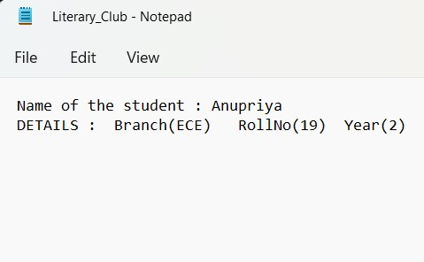

# NITJ-Clubs
### College Clubs Management System

*This project, NITJ-Clubs, is a College Clubs Management System built using Object-Oriented Programming (OOP) principles and file handling techniques.   
It facilitates the process of shortlisting students for various college clubs based on their hobbies and interests.  Each club has its own separate list, which is efficiently managed and communicated to the respective club heads.   
The code aims to provide a seamless platform for students to explore and engage in extracurricular activities aligned with their passions.*

 

A brief introduction to the project, highlighting the contributions of each team member.

 

A Visual representation, showcasing different Clubs forming the College Academic Club.

## Structure of the Program:

1. Header Inclusions:
    - Includes necessary header files such as `<iostream>`, `<string>`, `<fstream>`, `<cstdlib>`, and `<sstream>`.

2. Class Definition:
    - Defines the **Student class** representing a student with attributes like **name, roll number, branch, achievements, and year**. It includes member functions to get details, print details, and record achievements.

3. **Global Variables** and **Functions**:
    - Declares global variables and functions:
        - Array **stu[]** of Student objects.
        - Function **FindString()** to check for substrings.  

            *This function in the code **checks** if a given **substring** exists within a provided string.* 
               
         

        - Function **AddMembers()**   

            *To add students to club files based on their*achievements.  
             

            *This function in the code checks if a given substring exists within a provided string.*  

            It assists in **identifying specific keywords** or achievements within the student's academic or cultural achievements, enabling the program to **categorize students accordingly for club memberships** or other purposes.  
             
             ### **File Handling:**
             

            Opens club files in append mode to access or create them, writes student details, and closes the files. 

             

            1. `ofstream myfile`: Declares an output file stream object named `myfile`.     

            2. `ios::app`: Sets the file stream to append mode, ensuring new data is added at the end of the file.              
            3. `myfile<<`: Writes data to the file using the `<<` operator.  
            4. `myfile.close();`: Closes the file stream, ensuring data is properly saved and resources are released.
             
             

        - Function **student_details()**   
           
           *This function **input student details** and record achievements.*
        - Function **MainMenu()** to display the main menu.

4. Club Classes:
    - Defines base class Clubs with a **virtual function DisplayList()** to show the list of members.
    - Defines **derived classes** (Coding_club, Mechanics_club, Maths_club, Literary_club, Art_club) **inheriting from Clubs and implementing DisplayList()** to show club-specific member lists.

5. Viewing Clubs:
    - Function **view_clubs()** allows users to choose a club to view. It **creates an object of the corresponding derived class** and calls **DisplayList() to show the member list**.

6. Main Function:
    - main() function is the **entry point** of the program. It calls **MainMenu()** to start execution.

 

## Execution Flow:  
- The program starts with the **main menu** where the user can choose to enter student details or view club lists.  
- If the user chooses to **enter student details**, they input details including achievements. The program then shortlists the students based on their achievements and adds them to respective club files.  
- If the user chooses to view clubs, they select a club to view its member list.  
- After completing the desired action, the user can continue or exit the program.

**Shortlisting for Clubs**:  
- Based on the achievements entered by the students, the program adds their names to respective club files.  
- For example, students with coding achievements are added to the Coding Club file, students with literary achievements to the Literary Club file, etc.

 

## Output Terminal
 

*Creates seprate files for diffrent Clubs and updates the same file when new records are added*  

 

 

## OOPs Concepts Used
 

*Showcases Various Object Oriented Programming concepts used in the code*